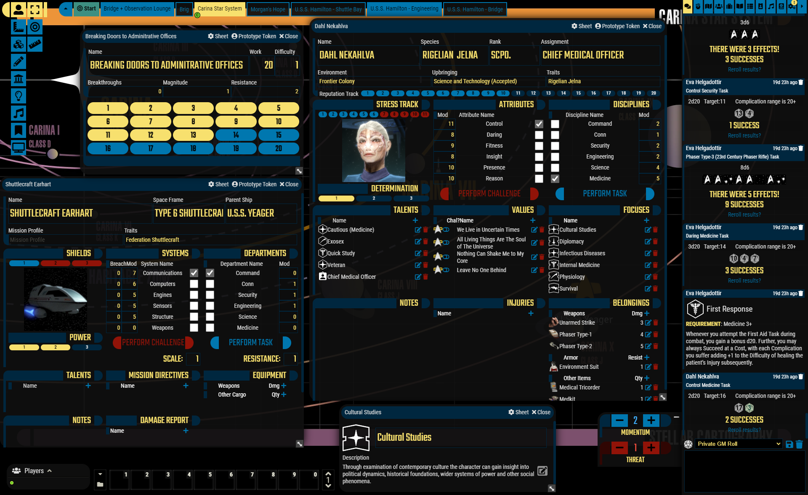

# Space Opera Ui for SWFFG/STA.
A dodgy fork of [LCARS UI](https://github.com/FabulistVtt/sta-lcars-ui) by [Fabulist](https://github.com/FabulistVtt). I wanted to be able to use this interface on all Space Opera games like :
- Star Wars FFG.
- Star Trek Adventures.
- Metal Adventures.

## Installation
To install, follow these instructions:

1.  Inside Foundry, select the Game Modules tab in the Configuration and Setup menu.
2.  Click the Install Module button and enter the following URL: 
https://gitlab.com/sasmira/space-op-ui/-/raw/main/module/module.json
3.  Click Install and wait for installation to complete.

## Please note: The appearance of the interface differs depending on the system. The examples below show the interface corresponding to the system for which it was created.
### Improved Space Opera UI for Star Wars FFG

### Improved Space Opera/LCARS UI for Star Trek Adventures
