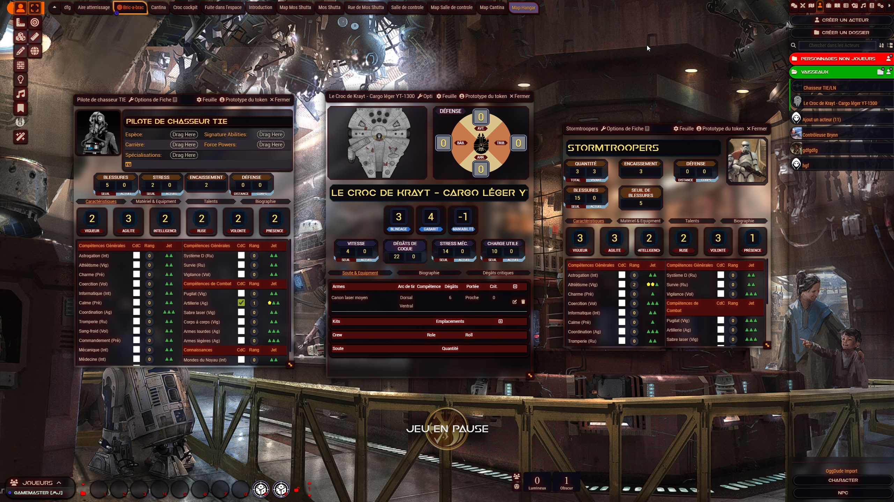
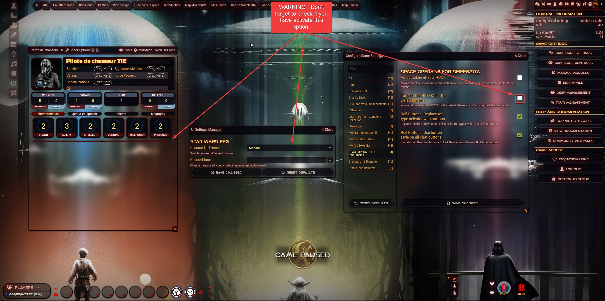

# FFG Star Wars Space Opera Ui.
Overhauls the Foundry UI and  StarWarsFFG games. Based on a dodgy fork of [LCARS UI](https://github.com/FabulistVtt/sta-lcars-ui) by [Fabulist](https://github.com/FabulistVtt). 
- Join the [official Discord server](https://discord.gg/foundryvtt)
- Rejoignez le [Discord Officiel de la communauté Francophone](https://discord.gg/pPSDNJk)

#### System supported
- [Star Wars FFG](https://github.com/StarWarsFoundryVTT/StarWarsFFG) Only

## Installation
To install, follow these instructions:

1.  Inside Foundry, select the Game Modules tab in the Configuration and Setup menu.
2.  Click the Install Module button and enter the following URL: 
https://gitlab.com/sasmira/space-op-ui/-/raw/main/module/module.json
3.  Click Install and wait for installation to complete.

## Please note: The appearance of the interface differs depending on the system. The examples below show the interface corresponding to the system for which it was created.
### Improved Space Opera UI for Star Wars FFG

#### Warning : There are two themes in SWFFG system. Don't forget to use this option (see below) if you use Mandar Theme.

